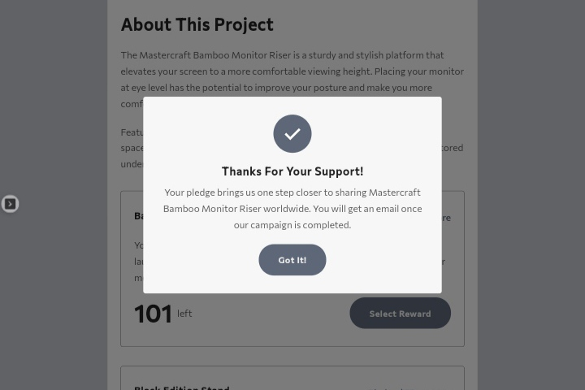
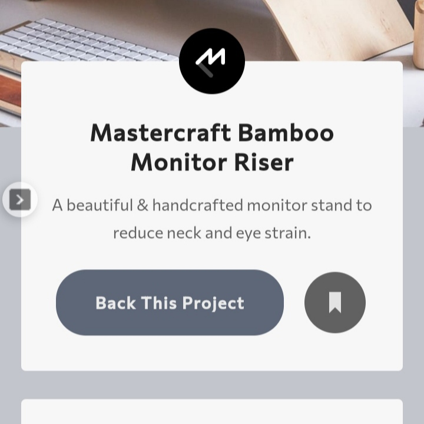

# Frontend Mentor - Crowdfunding product page solution

This is a solution to the [Crowdfunding product page challenge on Frontend Mentor](https://www.frontendmentor.io/challenges/crowdfunding-product-page-7uvcZe7ZR).
I used a different color palette (no offense to frontendmentor 🙇‍♂️), and decided to add a footer to this project.


## Table of contents

- [Overview](#overview)
  - [The challenge](#the-challenge)
  - [Screenshot](#screenshot)
  - [Links](#links)
- [My process](#my-process)
  - [Built with](#built-with)
  - [What I learned](#what-i-learned)
  - [Continued development](#continued-development)
  - [Useful resources](#useful-resources)
- [Author](#author)
- [Acknowledgments](#acknowledgments)


## Overview

### The challenge

Users should be able to:

- View the optimal layout depending on their device's screen size
- See hover states for interactive elements
- Make a selection of which pledge to make
  - Here, users can see some basic form validation on 'keyup' and 'blur'
  - Also, users can see how the 'Mahogany Special Edition' pledge section gets disabled when there are no pledges left
- See an updated progress bar and total money raised based on their pledge total after confirming a pledge
- See the number of total backers increment by one, and pledges left decrement by one after confirming a pledge
- Toggle whether or not the product is bookmarked
- See the changes remain even after refreshing the page for a single seesion
- Click on the social media icons directing them to that social media profile page
- See how the number of days left dynamically change after 12 noon

### Screenshot


<div align="center" style="display: flex; gap: 0.5rem; width: 100%;">
  
  
</div>

### Links

- Solution URL: [https://crowdfunding-xeyx-fago12.vercel.app/](https://crowdfunding-xeyx-fago12.vercel.app/)

## My process

### Built with

- Semantic HTML5 markup
- CSS custom properties
- Flexbox
- CSS Grid
- Mobile-first workflow
- Vanilla JavaScript (with sessionStorage)


### What I learned

In the course of building this project, I learnt a lot of cool and awesome stuffs. Listed below, are some of the new tricks I am happy to have under my sleeve:

```html
<svg class="class-name">
  <use xlink:href="some-path"></use>
</svg>
<!-- I learnt how to manipulate SVGs with this tags -->
```
```css
.class-name li:not(:last-child)::after {
  all: unset;
}
/*
 - The above css selector saved me the stress of adding extra classes to html elements
 - The all property and unset value helped me to reset css styles added to selector elements
*/

.btn {
  -webkit-tap-highlight-color: transparent;
}
/*
This css property and value helped with the default blue highlight color when a button is clicked
*/
```
```js
let x = "89,914";
console.log(x.split(",").join(""));
//output - "89914";
//split and join methods helped with getting rid of the comma
```

### Continued development

Since this is my first project implementing JavaScript, I am proud of what this project turned out to be. I really wanted to test my state management with Vanilla JavaScript. But, I know I have a long way to go. I really need to master arrow functions and ES6 JavaScript syntaxes, and many more.

### Useful resources

- [Stack Overflow](https://stackoverflow.com/) - A great help. I always feel intimidated and motivated when I look for answers here.
- [W3Schools](https://www.w3schools.com/) - A helpful resource when those little things get mixed up in my head.


## Author

- LinkedIn - [Ayoyemi Fagoroye](https://www.linkedin.com/in/ayoyemi-fagoroye)
- Frontend Mentor - [@Fago12](https://www.frontendmentor.io/profile/Fago12)
- Twitter - [@ayoyemi_stephen](https://www.twitter.com/ayoyemi_stephen)


## Acknowledgments

Special thanks to God. I started the year without no knowledge of JavaScript, and now I can do this. Also, big ups to [Coding Addict](https://youtube.com/c/CodingAddict), [The Net Ninja](https://youtube.com/c/TheNetNinja), [Kevin Powell](https://youtube.com/kepowob) and some other great YouTube channels. I am the developer I am today, all thanks to the freebies I get from these Youtube channels.
